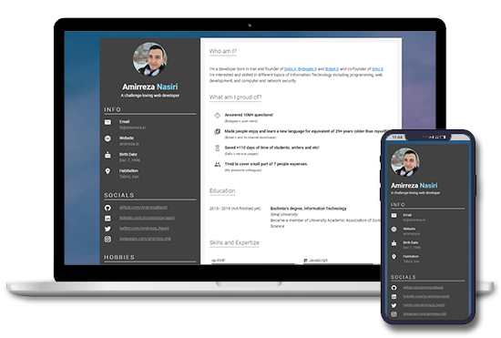

<h1 align="center">
  <br>
  <a target="_blank" href="https://evryn.github.io/vue-modern-resume/">
    
  </a>
  <br>
  Vue Modern Resume
  <br>
</h1>

<h4 align="center">
  🚀 See yourself:
  <a href="https://evryn.github.io/vue-modern-resume/">
     Demo
  </a>
</h4>

*NOTE: All personal contents will be removed very soon on next release. Don't worry about them.*

## What is Vue Modern Resume?
Vue Modern Resume is basically a simple (yet easy to setup) resume template based on <a href="https://vuejs.org/">Vue.js</a> framework and <a href="https://vuetifyjs.com/">Vuetify</a> UI toolkit.

## Preview
See the [raw demo](https://evryn.github.io/vue-modern-resume/) or my own [portfolio](https://amirreza.in) based-on Vue Modern Resume.


## How to use

1. Clone this repository.
```
git clone https://github.com/evryn/vue-modern-resume
```

2. Go to the cloned directory (e.g. `cd vue-modern-resume`).

3. Run `npm install`.

4. Customize your resume

5. Preview resume with `npm serve`.

6. Build it with `npm build`.

## Contribution
Feel free to add your own templates, language supports, bug fixes or improvements. Any kind of help is appreciated! If you make any kind of changes to an existing template, please commit them as a new template.

## License
Code is licensed under the [MIT License](LICENSE).

# See Also
* [ByteGate](https://bytegate.ir/) (our blog)
* [تبدیل PDF به ورد](http://delix.ir/) (our sponsored service)
